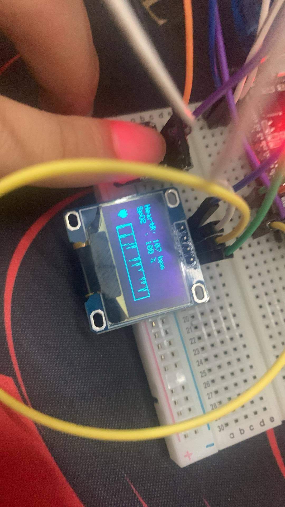
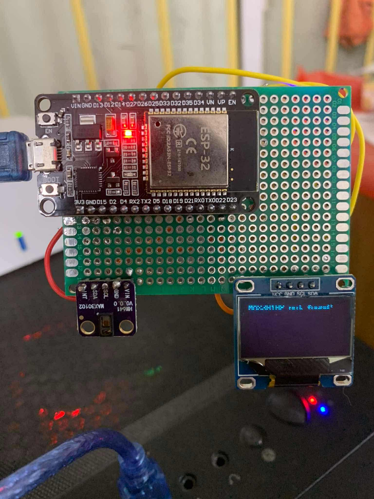
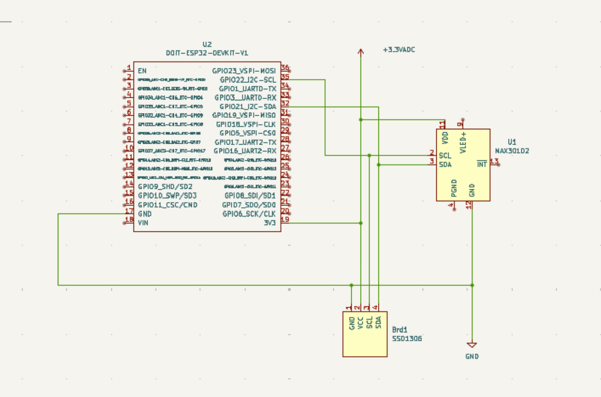

# BTL_DOLUONG-MAX30102-HeartRate-SpO2-Monitor
<div align="center">

Một dự án PlatformIO dùng để theo dõi nhịp tim và SpO2 sử dụng cảm biến MAX30102, vi điều khiển ESP32 và màn hình OLED SSD1306.

</div>

## 1.Overview
Dự án này sử dụng framework PlatformIO để xây dựng một thiết bị theo dõi nhịp tim và nồng độ oxy trong máu (SpO2). Chương trình được viết bằng ngôn ngữ C++ cho vi điều khiển ESP32 DevKit V1. Hệ thống có chức năng đọc dữ liệu thô từ cảm biến MAX30102, xử lý để tính toán các chỉ số sức khỏe, và hiển thị kết quả lên màn hình OLED SSD1306, bao gồm cả biểu đồ sóng hồng ngoại (IR) theo thời gian thực.

## 2.Product Image:



## 2.1Product Clip:


## 3.Features
-   Giao diện khởi động: Hiển thị các thông báo chào mừng và trạng thái khi hệ thống bắt đầu.
-   Phát hiện ngón tay: Tự động kiểm tra và thông báo cho người dùng đặt ngón tay lên cảm biến để bắt đầu đo.
-   Đo lường thời gian thực: Thu thập, tính toán và hiển thị liên tục chỉ số nhịp tim (BPM) và SpO2 (%).
-   Hiển thị trực quan: Sử dụng màn hình OLED để hiển thị các chỉ số đo được, trạng thái hoạt động, và biểu tượng trái tim.
-   Biểu đồ sóng IR: Vẽ biểu đồ dạng sóng của tín hiệu hồng ngoại (IR) theo thời gian thực, giúp người dùng thấy được tín hiệu tim mạch.

## 4.Tech Stack
    -   Ngôn ngữ (Language): C++
    -   Framework: PlatformIO, Arduino
    -   Vi điều khiển (Microcontroller): ESP32 DevKit V1    
    -   Cảm biến (Sensor): MAX30102
    -   Màn hình (Display): OLED SSD1306 (128x64, I2C)

### Libraries:
    -   SparkFun MAX3010x Pulse and Proximity Sensor Library
    -   Adafruit GFX Library
    -   Adafruit SSD1306

## 5.Quick Start
### Yêu cầu (Prerequisites)
* Phần mềm: Đã cài đặt Visual Studio Code và extension PlatformIO IDE.

### Phần cứng:
* 1x Board ESP32 DevKit V1
* 1x Cảm biến MAX30102
* 1x Màn hình OLED SSD1306 128x64
* Dây cắm và breadboard.

### Kết nối phần cứng (Hardware Wiring)
* Kết nối các chân theo sơ đồ sau:

* Xuất sang Trang tính
* Cài đặt (Installation)
### Clone repository:

```Bash

git clone https://github.com/minhnq1402/BTL_DOLUONG-MAX30102-HeartRate-SpO2-Monitor.git
cd BTL_DOLUONG-MAX30102-HeartRate-SpO2-Monitor
Mở bằng PlatformIO: Mở thư mục dự án vừa clone về bằng Visual Studio Code (với extension PlatformIO).

Biên dịch và Nạp code: PlatformIO sẽ tự động đọc file platformio.ini và cài đặt các thư viện cần thiết. Sau khi cài đặt xong, bạn có thể sử dụng các nút chức năng của PlatformIO (dấu tick ✓ để Build, mũi tên → để Upload) để biên dịch và nạp chương trình vào ESP32.
```
## 6.Project Structure
```
BTL_DOLUONG-MAX30102-HeartRate-SpO2-Monitor/
├── .gitignore
├── .vscode/          # Cài đặt riêng của VS Code
├── include/          # Chứa các file header (.h)
├── lib/              # Chứa các thư viện của dự án (PlatformIO tự quản lý)
├── platformio.ini    # File cấu hình chính của dự án PlatformIO
├── src/              # Chứa mã nguồn chính (main.cpp)
└── test/             # Chứa các file kiểm thử (test)
```
## 7.Configuration
Cấu hình chính của dự án nằm trong file platformio.ini. File này định nghĩa bo mạch được sử dụng, framework, tốc độ cổng Serial và quan trọng nhất là các thư viện phụ thuộc (lib_deps).

Ini, TOML
```
[env:esp32dev]
platform = espressif32
board = esp32dev
framework = arduino
lib_deps =
    adafruit/Adafruit GFX Library
    adafruit/Adafruit SSD1306
    sparkfun/SparkFun MAX3010x Pulse and Proximity Sensor Library
monitor_speed = 115200
```
## 8
Mọi đóng góp đều được chào đón! Vui lòng mở một issue để thảo luận về những thay đổi bạn muốn thực hiện trước khi tạo pull request.

<div align="center">

Made with ❤️ by minhnq1402

</div>